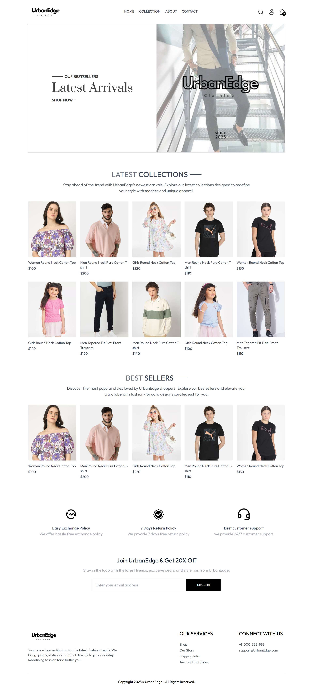

<h2 align="center">UrbanEdge Clothing Ecommerce Website</h2>
<p align="center">
An Awesome Ecommerce Web Application showcasing the latest Urban Clothing and Accessories.
</p>

## Project Overview

This web application serves as an ecommerce platform to display a variety of clothing products, facilitate shopping, and provide an engaging shopping experience. It includes features like product listings, shopping cart functionality, and a seamless checkout process.

Visit the deployed page at [UrbanEdge Ecommerce Website](https://ecommerce-website-sand-ten.vercel.app/) to see the live application in action.  
For the code, visit GitHub at [UrbanEdge Ecommerce](https://github.com/kvskmurty2802/UrbanEdge-Ecommerce.git).




## Table of Contents

- [Project Overview](#project-overview)
- [Table of Contents](#table-of-contents)
- [Features](#features)
- [Installation](#installation)
- [Usage:](#usage)
- [Contributing](#contributing)
- [🔝 Top Contributed Repositories](#-top-contributed-repositories)
- [Contact](#contact)
- [💰 You can help me by Donating](#-you-can-help-me-by-donating)

## Features

- **Product Showcase:** Displays detailed information about clothing and accessories with images and descriptions.
- **Shopping Cart:** Add, update, and remove items with a dynamic cart interface.
- **Checkout Process:** Streamlined checkout experience for users.
- **Responsive Design:** Optimized for various screen sizes, ensuring a seamless user experience.
- **Interactive UI:** Engaging and user-friendly interface for smooth navigation.

## Installation

1. Clone the repository:
   ```bash
   git clone https://github.com/kvskmurty2802/UrbanEdge-Ecommerce.git
2. Navigate into the project directory:
   ```bash
    cd Portfolio_Page
3. Install dependencies:
   ```bash
    npm install
## Usage:

1. Start the development server:
   ```bash
    npm run dev
2. Open your browser and visit below link to view the weather page.
   ```bash
    http://localhost:5173
## Contributing

Contributions are welcome! Please follow these steps:

1. Fork the repository.
   
2. Create a new branch (`git checkout -b feature/my-feature`).
   
3. Commit your changes (`git commit -am 'Add new feature'`).
   
4. Push to the branch (`git push origin feature/my-feature`).
   
5. Open a pull request.


## 🔝 Top Contributed Repositories

Here are some of my top contributed repositories:

[TheMovieDB](https://github.com/kvskmurty2802/TheMovieDB) - [](https://themoviedb-wine.vercel.app/)

[Portfolio Page](https://github.com/kvskmurty2802/Portfolio_Page) - [](https://portfolio-page-nu-two.vercel.app/)

[Weather Page](https://github.com/kvskmurty2802/Weather_Page) - [](https://weather-page-eight.vercel.app/)


Feel free to explore these projects and contributions!

## Contact

GitHub Profile: [kvskmurty2802](http://github.com/kvskmurty2802/)

Contact me via [Email](mailto:krishnamurty2802@gmail.com).


## 💰 You can help me by Donating
[](https://buymeacoffee.com/kvskmurty2802) 
[](https://www.paypal.com/paypalme/kvskmurty2802/) 
